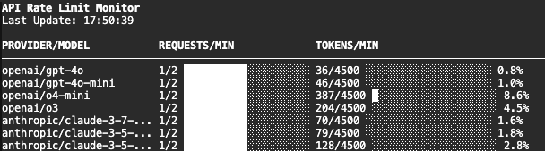

# LLM Rate Limiter

[](https://www.python.org/downloads/)
[](https://opensource.org/licenses/Apache-2.0)
[](https://github.com/psf/black)

Created by [Jacob Phillips](https://jacobdphillips.com/)


A Python package for managing rate limits when making API calls to remote model providers. It provides built-in monitoring and visualization of rate limit usage across different providers and models.




## Features

- Configurable limits for:
  - Requests per minute
  - Tokens per minute
- Real-time monitoring dashboard
- YAML-based configuration
- Thread-safe implementation
- Automatic cleanup of old rate limit data
- Support for async/await patterns
- Built-in monitoring and statistics tracking

## Installation
<details>
<summary>Click to expand</summary>
Clone and install the package. We recomend using `uv` for fast and reliable dependency management.


1. Install `uv` if you haven't already:
```bash
curl -LsSf https://astral.sh/uv/install.sh | sh
```

2. Clone the repository
```bash
git clone https://github.com/jacobphillips99/llm-rate-limiter
cd llm-rate-limiter
```

3. Create and activate a virtual environment
```
uv venv .venv --python=python3.10
source .venv/bin/activate
```

4. Install the package
```
uv pip install -r requirements.txt
# (optional dev dependencies)
# uv pip install -r requirements-extras.txt
# use -e for editable mode
uv pip install -e .
```

5. Set any API keys in your environment
```bash
export OPENAI_API_KEY="..."
export ANTHROPIC_API_KEY="..."
export GEMINI_API_KEY="..."
```

For the example script, we recomend also setting `LITELLM_LOG` to `ERROR` to avoid cluttering the terminal with debug logs.
```bash
export LITELLM_LOG="ERROR"
```

When using `llm-rate-limiter` in other packages, you can set the log level by setting the environment variable `LLM_RATE_LIMIT_LOG_LEVEL` which conforms to the [python logging levels](https://docs.python.org/3/library/logging.html#logging-levels).
```bash
export LLM_RATE_LIMIT_LOG_LEVEL="ERROR"
```

6. Try the example script!
```bash
python example.py
```
In a separate terminal, run the monitoring UI:
```bash
python -m llm_rate_limiter.ui
```

7. We use `pre-commit` to ensure code quality. After cloning the repo, install the pre-commit hooks by running:
```bash
pre-commit install
```
All setup is done!

</details>

## Configuration

Rate limits for each provider and model are specified in a YAML file. The [default configuration](https://github.com/jacobphillips99/llm-rate-limiter/blob/main/src/llm_rate_limiter/default_rate_limits.yaml) implements the rate limits for OpenAI, Anthropic, and Gemini Free / Tier 1 limits. Here's an example configuration:

```yaml
openai:
  gpt-4:
    requests_per_minute: 200
    tokens_per_minute: 40000
  ...
anthropic:
  claude-2:
    requests_per_minute: 100
    tokens_per_minute: 20000
```

You can provide a path to your own, custom rate limit config file by setting the `RATE_LIMIT_CONFIG_PATH` environment variable.

## Usage
The rate limiter is a singleton object that can be accessed by importing the [`rate_limiter`](https://github.com/jacobphillips99/llm-rate-limiter/blob/main/src/llm_rate_limiter/rate_limit.py#L373) object from the `llm_rate_limiter.rate_limit` module. The rate limiter is thread-safe and uses locks to ensure that reads and writes to the rate limit data are atomic.

The system works by calling `wait_and_acquire` to wait for the rate limit to be available and then calling `record_usage` to record the actual token usage after the call. This way, the rate limiter can be used in both sync and async codebases and is compatible with any LLM provider. The rate limiter natively prevents any remote API calls from exceeding the provider's rate limits.

See the [example script](https://github.com/jacobphillips99/llm-rate-limiter/blob/main/example.py) for a complete example of how to use the local rate limiter.

### Basic Usage
A minimal example of using the rate limiter is shown below. We create an async function that makes an API call to a remote model provider and then record the usage of tokens and requests to the rate limiter. The rate limiter will block the API call until the rate limit is available.

```python
from llm_rate_limiter.rate_limit import rate_limiter

async def safe_api_call(prompt: str, provider: str, model: str) -> str:
    payload = {"prompt": prompt, "model": model}
    estimated_token_consumption = len(prompt) // 4 + 1000

    # wait for rate limit to become available
    await rate_limiter.wait_and_acquire(provider=provider, model=model, tokens=estimated_token_consumption)

    # make the API call
    response = await make_actual_api_call(payload)

    # record usage
    rate_limiter.record_usage(provider=provider, model=model, tokens_used=response.usage.total_tokens)

    return response.json()

# we can generate all the requests and then allow the rate limiter to safely execute them in parallel
async def main():
    model = "gpt-4o"
    provider = "openai"
    prompts = [str(i) for i in range(10)]
    tasks = [safe_api_call(prompt, provider, model) for prompt in prompts]
    responses = await asyncio.gather(*tasks)

asyncio.run(main())
```

### Monitoring

The package includes a terminal-based monitoring UI that shows real-time rate limit usage. While the rate limiter is running, it starts a separate thread to store, process, and save the rate limit data. This [`monitor`](https://github.com/jacobphillips99/llm-rate-limiter/blob/main/src/llm_rate_limiter/rate_limit.py#L76) lives inside the rate limiter and writes out the data to a file in the background. We build a [simple UI](https://github.com/jacobphillips99/llm-rate-limiter/blob/main/src/llm_rate_limiter/ui.py) to visualize the live rate limit data, which can be run in the terminal.


## Acknowledgements and Citation
This project was developed by [Jacob Phillips](https://jacobdphillips.com) as a part of the [Andreessen Horowitz American Dynamism Engineering Fellows program](https://a16z.com/the-american-dynamism-engineering-fellows-program/). Special thanks to the American Dynamism team for their support and feedback on the project.

If using the rate limiter in your work, please cite it to acknowledge the authors. Suggested format:

```bibtex
@software{llm_rate_limiter,
    title = {LLM Rate Limiter},
    author = {Jacob Phillips},
    url = {https://github.com/jacobphillips99/llm-rate-limiter},
    version = {0.1.0},
    date = {2025-05-11},
    year = {2025},
}
